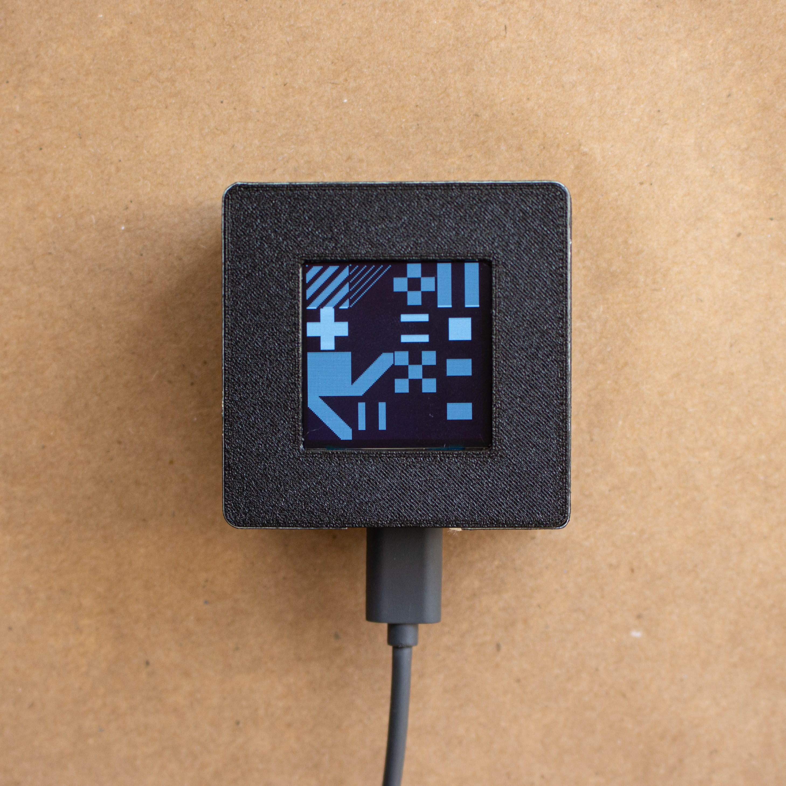

# TinkerPod

## Status of This Document

This document describes the Tinker Pod project its features and specifications.

For complete information about this project visit https://github.com/juansulca/tinker-pod

## Copyright Notice

Copyright (c) 2024 Juan Sulca. All rights reserved.

TinkerPod (c) 2024 by Juan Sulca is licensed under CC BY-SA 4.0. To view a copy of this
license, visit https://creativecommons.org/licenses/by-sa/4.0/

For more information on licensing visit https://github.com/juansulca/tinker-pod

## Introduction

TinkerPod is an open-source platform designed for makers, creative coders, and designers,
providing hackable and customizable hardware and software. Inspired by the evolution of
multitools and influenced by contemporary open-source hardware and generative art, this project
explores the application of critical making and personal fabrication to open-source hardware.
TinkerPod aims to bridge the gap between specialized engineering tools and accessible, user-
friendly hardware for creative and technical exploration.

## Research project

This project was part of a Master of Design research project at OCAD University. You can read the complete document here
https://openresearch.ocadu.ca/id/eprint/4728/1/TinkerPod_JuanSulca.pdf
